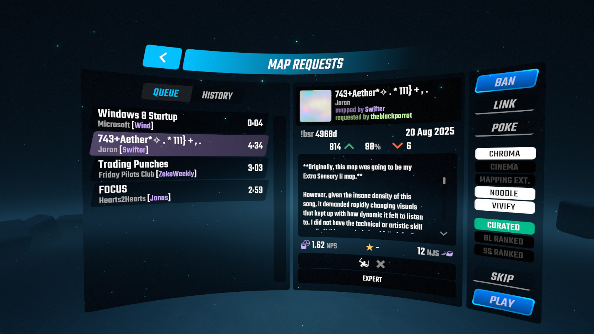

# DumbRequestManager
A map request manager for Beat Saber that abstracts out functions to an HTTP GET API, with a WebSocket API and Webhook API for real-time in-game queue event responses.  

Essentially meaning, any streaming bot you use (e.g. Streamer.bot, Firebot, MixItUp, etc.) now has request queue functionality -- so long as it supports making HTTP requests (at the minimum).

> [!IMPORTANT]
> This is not a mod that is instantly ready to go, unlike most other request queue managers. It *will* require manual setup on your part. Filters, limits, so on and so forth will be something you add in the bot of your choice.



## Dependencies
Currently only tested on Beat Saber versions 1.39.1 or newer. Versions of the mod for older game versions are not planned at this time.
> [!NOTE]
> Some issues involving version 3.15.3 of SongCore may intermittently pop up from time to time. **This only effects 1.40.1, 1.40.2, 1.40.3, and 1.40.4.**
>
> 1.39.1 and 1.40.0 *(which use older versions)* seem to be stable.

### Mods
- BeatSaberMarkupLanguage
- BeatSaberPlaylistsLib
- BeatSaverSharp
- BeatSaverVoting
- protobuf-net
- SiraUtil
- SongCore
- websocket-sharp
----

# HTTP API
By default, a simple HTTP server is started on `http://localhost:13337`. Port and IP can be changed in the mod's JSON configuration file. A game restart (a hard restart) is required for changes to take effect.
> [!CAUTION]
> It is **NOT RECOMMENDED** to let this listen on a public IP address. Unless you know what you're doing, stick to `localhost`/`127.x.x.x` IP ranges or any LAN IP range (`10.x.x.x`; `172.16.x.x - 172.31.x.x`; or `192.168.x.x`).

> [!CAUTION]
> If you are behind a firewall, it is **NOT RECOMMENDED** to forward the port you use for this HTTP server, unless you know what you are doing. Forwarding this means allowing anyone outside your local network will have full read/write access to your queue.

As this is really only a web server, you can test any of these endpoints in any web browser of your choice, while the game is running of course. 

| Endpoint     | Sub-command | Method | Description/Example                                                                                                                                                                                                                                                                                                                                                                                                                                                                                  | Returns                                            |
|--------------|-------------|--------|------------------------------------------------------------------------------------------------------------------------------------------------------------------------------------------------------------------------------------------------------------------------------------------------------------------------------------------------------------------------------------------------------------------------------------------------------------------------------------------------------|----------------------------------------------------|
| `/addKey`    |             | GET    | Adds a map to the queue.<br/>- User identifiers can be tacked on with a `user` query parameter. Internally this is set as a string, anything can be used so long as it's unique.<br/>- Maps can be prepended to the list instead of appended by tacking on the `prepend` query parameter.<br/>- Service identifiers can be added by tacking on the `service` query parameter, useful if your requests come from multiple services.<br/>`/addKey/25f?user=TheBlackParrot&prepend=true&service=twitch` | [Map Data](#map-data-type)                         |
| `/addWip`    |             | POST   | Adds a WIP map to the top of the queue<br/>- User identifiers can be tacked on with a `user` query parameter.<br/>- Maps can be appended to the list instead of prepended by tacking on the `prepend` query parameter and setting it to `false`.<br/>- Service identifiers can be added by tacking on the `service` query parameter, useful if your requests come from multiple services.<br/><br/>**Direct URL to a zip file is required in POST data.**<br/><br/>`/addWip?user=TheBlackParrot`     | [Map Data](#map-data-type)                         |
| `/blacklist` |             | GET    | Retrieves all blacklisted map keys.<br/>`/blacklist`                                                                                                                                                                                                                                                                                                                                                                                                                                                 |                                                    |
|              | `/add`      | GET    | Flags a map key that should not be allowed in the queue.<br/>`/blacklist/add/25f`                                                                                                                                                                                                                                                                                                                                                                                                                    |                                                    |
|              | `/remove`   | GET    | Removes a map key from the blacklist.<br/>`/blacklist/remove/25f`                                                                                                                                                                                                                                                                                                                                                                                                                                    |                                                    |
| `/query`     |             | GET    | Queries a local cache (and then BeatSaver if map data hasn't been cached yet) for map information.<br/>`/query/25f`                                                                                                                                                                                                                                                                                                                                                                                  | [Map Data](#map-data-type)                         |
|              | `/nocache`  |        | Queries BeatSaver directly, skipping the local cache.<br/>`/query/nocache/25f`                                                                                                                                                                                                                                                                                                                                                                                                                       | [Map Data](#map-data-type)                         |
| `/queue`     |             | GET    | Get maps currently in the queue.<br/>`/queue`                                                                                                                                                                                                                                                                                                                                                                                                                                                        | (Array) [Map Data](#map-data-type)                 |
|              | `/where`    |        | Get user positions in the queue, along with map data from the maps the targeted user has in queue.<br/>`/queue/where/TheBlackParrot`                                                                                                                                                                                                                                                                                                                                                                 | (Array) [Queue Position Data](#queue-data-type)    |
|              | `/clear`    |        | Clears the queue.<br/>`/queue/clear`                                                                                                                                                                                                                                                                                                                                                                                                                                                                 | [Message](#message-data-type)                      |
|              | `/open`     |        | Opens and closes the request queue.<br/>`/queue/open/true`                                                                                                                                                                                                                                                                                                                                                                                                                                           | [Message](#message-data-type)                      |
|              | `/move`     |        | Moves the wanted queue entry (first number) to a different spot in the queue (second number *OR* `top`/`bottom`).<br/>`/queue/move/4/1`                                                                                                                                                                                                                                                                                                                                                              | [Message](#message-data-type)                      |
|              | `/shuffle`  |        | Shuffles the request queue.<br/>`/queue/shuffle`                                                                                                                                                                                                                                                                                                                                                                                                                                                     | [Message](#message-data-type)                      |
| `/history`   |             | GET    | Gets the current play session history, sorted most recent to least recent.<br/>Response limits can be tacked on with a `limit` query parameter.<br/>`/history?limit=1`                                                                                                                                                                                                                                                                                                                               | (Array) [Session History Data](#history-data-type) |
| `/version`   |             | GET    | Gets version information for both the mod and the game.<br/>`/version`                                                                                                                                                                                                                                                                                                                                                                                                                               |                                                    |

# WebSocket API
By default, a WebSocket server is started on `http://localhost:13338`, acting as a firehose (meaning it just spits out information, no input is taken into account). Port and IP can be changed in the mod's JSON configuration file. A game restart (a hard restart) is required for changes to take effect.

> [!CAUTION]
> It is **NOT RECOMMENDED** to let this listen on a public IP address. Unless you know what you're doing, stick to `localhost`/`127.x.x.x` IP ranges or any LAN IP range (`10.x.x.x`; `172.16.x.x - 172.31.x.x`; or `192.168.x.x`).

**This is only used for button-press events to avoid feature creep with other mods adding WebSocket support for other data.** You do not need to use this if you don't want to or can't use it.

<a name="websocket-events"></a>
## Events
You can use these events in any way you would like to -- the intentions here are listed to explain the intended use of pressing the corresponding in-game button. 

| Event          | Intention                                                        |
|----------------|------------------------------------------------------------------|
| `mapAdded`     | A map was added to the queue                                     |
| `mapReAdded`   | A previously actioned map was re-added to the queue              |
| `pressedBan`   | Banning/blacklisting a requested map                             |
| `pressedLink`  | Sending a direct link to a requested map                         |
| `pressedPlay`  | Playing a requested map                                          |
| `pressedPoke`  | Mentioning/poking/grabbing attention of the next person in queue |
| `pressedSkip`  | Skipping a requested map                                         |
| `queueCleared` | Clearing the queue                                               |
| `queueOpen`    | Closing or opening the queue                                     |

All `pressed` events and `map` events follow the same data structure:
```json
{
  "Timestamp": 1745374880148,
  "EventType": "pressedSkip",
  "Data": <map data>
}
```
`queueOpen` uses the following data structure:
```json
{
  "Timestamp": 1745374880148,
  "EventType": "queueOpen",
  "Data": <true | false>
}
```

# Webhook API

> [!NOTE]
> Webhooks are not triggered by default, you must define a valid URL in your configuration file (`UserData/DumbRequestManager.json`) before they will fire.

Some bot software (like MixItUp) support Webhooks, which will trigger commands once it detects data POSTed to a URL.

For valid events and their intended use, see the [WebSocket events](#websocket-events).

All `pressed` events follow the same data structure:
```json
{
  "timestamp": 1745374880148,
  "id": "33f0216b-bbed-4784-a9fd-aead73fae069",
  "event": "pressedSkip",
  "data": <map data>
}
```
`queueOpen` uses the following data structure:
```json
{
  "timestamp": 1745374880148,
  "id": "33f0216b-bbed-4784-a9fd-aead73fae069",
  "event": "queueOpen",
  "data": <true | false>
}
```

# Data structures/schema

<a name="map-data-type"></a>
## Map data
> [!CAUTION]
> It is ***STRONGLY ADVISED*** that you do **NOT** show user-editable map metadata in your chat responses, [as BeatSaver has no bare-minimum filters in place for map uploads](https://discord.com/channels/882730837974609940/882730837974609943/983438702938300488).  
> 
> If you still want to risk it, at least check if any of the `CensorTitle`, `CensorSubTitle`, `CensorArtist`, and `CensorMapper` attributes are set to `true`. There are ways to get around these, of course, but the filters on DRM's side are bare minimum enough to prevent auto-bans on Twitch.
> 
> > (Also of note, Twitch viewers/users with the Moderator status do not have any AutoMod rulesets applied to them. If your bot is a moderator in your channel, responses will be allowed through verbatim.)
```json
{
  "BsrKey": <string (BeatSaver map key)>,
  "Hash": <string (40 character hash)>,
  "User": <string | null>,
  "Title": <string>,
  "CensorTitle": <boolean>,
  "SubTitle": <string>,
  "CensorSubTitle": <boolean>,
  "Artist": <string>,
  "CensorArtist": <boolean>,
  "Mapper": <string>,
  "CensorMapper": <boolean>,
  "MetaDataHasSplicedCensor": <boolean>,
  "Duration": <int (seconds)>,
  "Votes": [<int (upvotes)>, <int (downvotes)>],
  "Rating": <float (0-1)>,
  "UploadTime": <int (unix timestmap (seconds))>,
  "LastUpdated": <int (unix timestmap (seconds))>,
  "Cover": <string (image URL, jpg format)>,
  "Automapped": <boolean>,
  "ScoreSaberRanked": <boolean>,
  "BeatLeaderRanked": <boolean>,
  "Curated": <boolean>,
  "CuratorName": <string>,
  "Playlists": [<string (playlist title)>, ...],
  "VoteStatus": <int (0 = no vote, 1 = upvote, 2 = downvote)>
  "UsesChroma": <boolean>,
  "UsesCinema": <boolean>,
  "UsesMappingExtensions": <boolean>,
  "UsesNoodleExtensions": <boolean>,
  "UsesVivify": <boolean>,
  "DataIsFromLocalMap": <boolean>,
  "DataIsFromLocalCache": <boolean>,
  "DataIsFromBeatSaver": <boolean>,
  "HasPlayed": <boolean>,
  "Blacklisted": <boolean>,
  "Diffs": [
    {
      "Difficulty": <string (Easy, Normal, Hard, Expert, ExpertPlus)>,
      "Characteristic": <string>,
      "NoteJumpSpeed": <float>,
      "NotesPerSecond": <float>,
      "MapMods": {
        "Chroma": <boolean>,
        "Cinema": <boolean>,
        "MappingExtensions": <boolean>,
        "NoodleExtensions": <boolean>,
        "Vivify": <boolean>
      },
      "ScoreSaberStars": <float>,
      "BeatLeaderStars": <float>
    },
    ...
  ]
} 
```
### (additional notes)
- `MetadataHasSplicedCensor` is a boolean indicating if an aggressively censored word was found spliced between multiple metadata fields.
   > (ex. if "apple" is censored aggressively, and *"c**ap**"* is the song title and *"**ple**ase"* is the artist, this will return `true`)
- `Diffs[x].BeatLeaderStars` will only be `0` if BeatLeader could not determine a star rating for a map, or if the map has been updated very recently. This will pull values from their own cached data, created every 24 hours.

<a name="queue-data-type"></a>
## Queue position data
```json
{
  "Spot": <int>,
  "QueueItem": <map data>
}
```

<a name="history-data-type"></a>
## Session history item
```json
{
  "Timestamp": <unix timestamp>,
  "HistoryItem": <map data>
}
```

<a name="message-data-type"></a>
## Message
```json
{
  "message": <string>
}
```